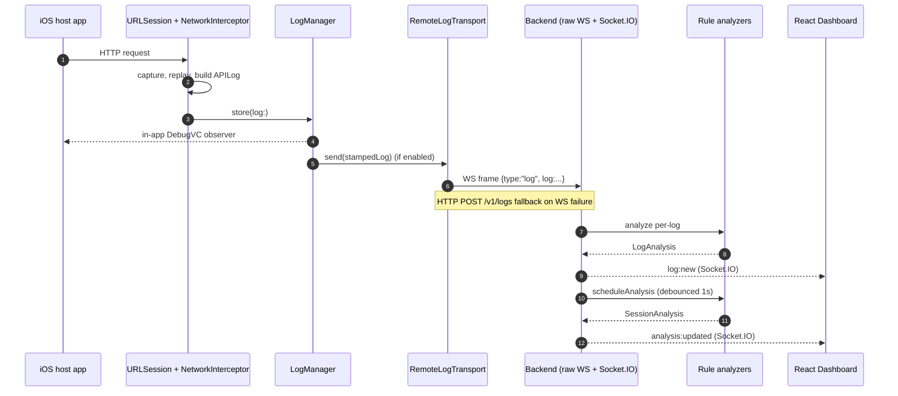

# iSpyAI Platform Architecture

The platform has two modes that coexist on the same `LogManager` pipeline:

- **MODE 1 - Local SDK Debugging** (pre-existing). Logs are captured, masked,
  stored in memory, and rendered by `DebugViewController` inside the host app.
  Works fully offline.
- **MODE 2 - Remote QA Monitoring** (additive, off by default). The same
  envelope is also stamped with session/device metadata and pushed to a
  backend over a WebSocket (HTTP fallback) where it is analyzed and broadcast
  to a live React dashboard.

Both modes share one capture surface. Disabling the remote transport (the
default) restores the original SDK behaviour exactly.

## Component map

```
+---------------------------- iOS host app -------------------------------+
|                                                                         |
|   URLSession  ->  NetworkInterceptor  ->  LogManager                    |
|                                              |                          |
|                                              +-- Local (existing)       |
|                                              |     in-memory + UI       |
|                                              |     (DebugViewController)|
|                                              |                          |
|                                              +-- Remote (additive)      |
|                                                    stamp + mask + cap   |
|                                                    -> RemoteLogTransport|
|                                                       (actor)           |
|                                                       |                 |
+-------------------------------------------------------|-----------------+
                                                        |
                                                  WS frames /
                                                  HTTP fallback
                                                        |
+----------------------------- Backend (Node 20) -------|-----------------+
|                                                       v                 |
|   /realtime/device  (raw WS, ws lib) ---+                               |
|   POST /v1/logs     (HTTP fallback)  ---+--> LogAnalyzer (rule-based)   |
|                                         |        |                      |
|                                         |        v                      |
|                                         +--> SessionStore (in-memory)   |
|                                                  | TTL janitor          |
|                                                  v                      |
|                                            SessionAnalyzer (debounced)  |
|                                                  |                      |
|                                                  v                      |
|   Socket.IO namespace `/realtime`  <-- broadcast (log:new,              |
|                                        sessions:snapshot,               |
|                                        analysis:updated)                |
+-------------------------------------------------------|-----------------+
                                                        |
                                                  Socket.IO
                                                        |
+---------------------------- Dashboard (React) --------v-----------------+
|   Zustand store  <- WSEvents.LogNew / SessionsSnapshot / AnalysisUpdated|
|                                                                         |
|   TopBar | Sidebar | Tabs(Live/Failed/Explorer/AI) | Detail Panel       |
+-------------------------------------------------------------------------+
```

## Component responsibilities

| Layer | Responsibility |
|-------|----------------|
| `NetworkInterceptor` (iOS, existing) | URLProtocol subclass that captures every request flowing through the SDK's `URLSession`. One additive change: skip requests to `IspyAIConfig.shared.backendURL.host` to prevent self-instrumentation. |
| `LogManager` (iOS, existing) | Privacy-masks headers, stores in memory, calls the rule-based per-log analyser, broadcasts to local UI. One additive change: when remote monitoring is enabled, stamp session/device/app/build and call `RemoteLogTransport.shared.send`. |
| `IspyAIConfig` (iOS, new) | Process-wide config struct. Master switch (`remoteMonitoringEnabled`), `backendURL`, `sessionId`, `deviceName`, `appVersion`, `buildNumber`, `maxBodyBytes`, `headerMaskKeys`. Off by default. |
| `RemoteLogTransport` (iOS, new) | Swift actor. Owns one `URLSessionWebSocketTask`. Truncates bodies + re-masks headers per `IspyAIConfig`. Queues up to 500 logs, drops oldest on overflow, exponential backoff reconnect (1, 2, 4, 8, 16, 30s). Falls back to `POST /v1/logs`. Never throws. |
| `backend/realtime/deviceWebSocket.ts` | Raw WS endpoint at `/realtime/device` accepting JSON frames from iOS. Routes hello + log frames into `SessionStore` + analyzer + Socket.IO fan-out. |
| `backend/realtime/index.ts` | Socket.IO namespace `/realtime` for the dashboard. Owns `session:joined` / `session:left` room membership, debounced `analysis:updated` broadcasts, `sessions:snapshot` reflows. |
| `SessionStore` | In-memory map keyed by sessionId. Bounded ring buffer of recent logs per session. Idle-session TTL janitor (default 24h). |
| `LogAnalyzer` / `RuleBasedAnalyzer` | Per-log heuristic; outputs `LogAnalysis`. Mirrors the iOS rules so device + server agree even when one is offline. |
| `SessionAnalyzer` / `RuleBasedSessionAnalyzer` | Per-session aggregation; outputs `SessionAnalysis` (Issue Summary, Root Cause, Failed/Slow/Auth APIs, Suggested Jira title/description, Severity). |
| `OpenAIAnalyzer*` (stubs) | Documents the prompt contract for a Phase 2 LLM-backed analyzer. Throws today. |
| Dashboard (`@ispyai/dashboard`) | Vite + React 18 + Tailwind + Zustand. Subscribes to Socket.IO; renders Sidebar / Live Stream / Failed / Explorer / AI Analysis tabs. Detail panel with cURL + copy. Share-link `?session=<id>` toggles read-only mode. |

## Data flow for one captured request

1. Host app's URLSession fires a request.
2. `NetworkInterceptor.canInit` accepts it (after skipping any backendURL host).
3. The interceptor replays the request, captures the response, builds an
   `APILog`, and hands it to `LogManager.store`.
4. `LogManager` masks headers, appends to its local in-memory buffer, prints
   the structured trace, runs `analyze(log:)`, and notifies local observers
   (the in-app `DebugViewController` still works exactly as before).
5. If `IspyAIConfig.shared.remoteMonitoringEnabled` is true, `LogManager`
   builds a stamped copy of the log and hands it to
   `RemoteLogTransport.shared.send(_:)` inside a `Task`. The local UI is
   not blocked on transport.
6. `RemoteLogTransport` truncates the body, re-masks headers using the
   `headerMaskKeys` set, JSON-encodes a `{"type":"log","log":...}` frame, and
   ships it over WebSocket. If the socket is down it falls back to
   `POST /v1/logs`. Failed transports stay queued (cap 500, drop-oldest).
7. Backend (`deviceWebSocket.ts` or `routes/logs.ts`) validates the payload
   against Zod, runs `RuleBasedAnalyzer.analyze` to produce the
   `LogAnalysis`, stores the envelope in `SessionStore`, and broadcasts
   `WSEvents.LogNew` on the Socket.IO `/realtime` namespace.
8. `SessionAnalyzer` is scheduled with a 1s debounce; on fire it produces a
   fresh `SessionAnalysis` and broadcasts `WSEvents.AnalysisUpdated`.
9. The dashboard's Zustand store appends the log and (when relevant) updates
   the per-session analysis card. Virtualised React rendering keeps the UI
   responsive at thousands of logs.

## Sequence diagram (Mermaid)



## AI layer plug points

- **Per-log**: implement `LogAnalyzer.analyze(log: APILog): Promise<LogAnalysis>`
  in `backend/src/ai/`. `RuleBasedAnalyzer` is the MVP. `OpenAILogAnalyzer`
  stub captures the future prompt contract.
- **Per-session**: implement `SessionAnalyzer.analyze({sessionId, envelopes}):
  Promise<SessionAnalysis>`. `RuleBasedSessionAnalyzer` is the MVP. The
  dashboard renders whichever implementation the backend selects without
  branching.
- **Selection knob (Phase 2)**: environment variable `LOG_ANALYZER` would
  switch between `rule-based` and `openai`. A factory in `index.ts` would
  pick the implementation and wire it into both the HTTP and WS code paths.

## Failure modes & guarantees

- Backend unavailable -> local SDK pipeline continues normally. Remote
  transport queues up to 500 logs, then drops oldest with a single warn.
- WebSocket dies -> exponential backoff reconnect. Pending logs are tried
  via HTTP fallback while the socket is down.
- Analyzer throws -> log is still recorded; only the analysis broadcast is
  skipped (warn-logged).
- Dashboard reload -> initial paint hydrates from REST
  (`/v1/sessions`, `/v1/sessions/:id/logs`, `/v1/sessions/:id/analysis`),
  then realtime stream takes over.
- Self-instrumentation -> `NetworkInterceptor` skips requests whose host
  matches `IspyAIConfig.shared.backendURL.host`.
